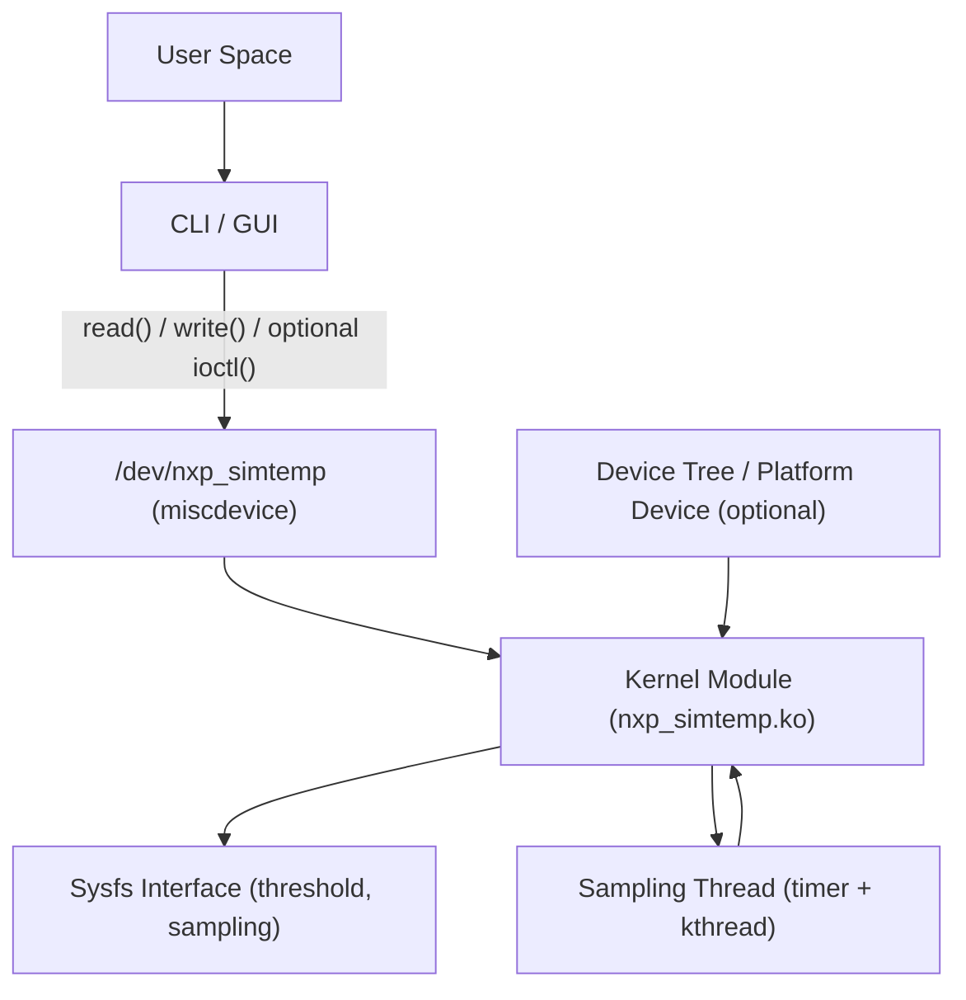

# NXP SimTemp Module - Design Documentation

## Overview

This document describes the architecture, API contract, threading model, and Device Tree (DT) support for the `nxp_simtemp` Linux kernel module. The module simulates a temperature sensor with periodic sampling, sysfs interface, poll support, and optional platform device/DT integration.

---

## Architecture



**Explanation:**  

- **CLI / GUI:** User-space programs interact with `/dev/nxp_simtemp` to read temperature samples or write thresholds.  
- **Sysfs:** Exposes threshold and sampling period as writable/readable attributes.  
- **Polling support:** User-space programs can wait for new samples using `poll()`.  
- **Timer / Sampling Thread:** Periodically generates simulated temperature samples and updates alert status.  
- **Device Tree / Platform Device:** Optional for configuration on embedded platforms (e.g., i.MX or QEMU).  

---

## Kernel Module Components

| Component | Purpose |
|-----------|---------|
| `nxp_simtemp_dev` (miscdevice) | Registers character device under `/dev/nxp_simtemp`. |
| `nxp_simtemp_read()` | Copies latest temperature sample to user-space. |
| `nxp_simtemp_write()` | Updates `threshold` from user-space writes. |
| `threshold_store()` / `threshold_show()` | Sysfs attribute for threshold. |
| `sampling_store()` / `sampling_show()` | Sysfs attribute for sampling interval (ms). |
| `timer_callback()` | Periodically generates samples, sets `alert` flag, wakes up waiting processes. |
| `sample_lock` | Mutex to protect shared sample/threshold data. |
| `sample_wq` | Wait queue for poll/read blocking. |
| `nxp_simtemp_platform_init()` | Registers a simple platform device for DT testing. |

---

## API Contract

**Device Node:** `/dev/nxp_simtemp`  
**Sysfs:** `/sys/class/misc/nxp_simtemp/{threshold,sampling}`  

| Interface | Path | Description |
|------------|------|-------------|
| **read()** | `/dev/nxp_simtemp` | Returns current temperature and alert state. |
| **write()** | `/dev/nxp_simtemp` | Updates threshold (in m°C). |
| **poll()** | `/dev/nxp_simtemp` | Signals when new sample is ready. |
| **Sysfs** | `/sys/class/misc/nxp_simtemp/threshold` | RW: temperature threshold. |
| **Sysfs** | `/sys/class/misc/nxp_simtemp/sampling` | RW: sampling interval in ms. |
| **ioctl()** | (optional) | Could extend for calibration, simulated faults, etc. |

---

## Threading / Locking Model

- **Mutex:** `sample_lock` protects access to `latest_sample` and `threshold`.  
- **Timer:** `timer_list` triggers periodic updates.  
- **Wait Queue:** `sample_wq` allows blocking reads or `poll()` until a new sample is available.  
- **Concurrency:** `read()` / `write()` / sysfs access are all synchronized via the mutex.  

---

## Device Tree (Optional)

- The kernel module registers a `platform_device` manually for testing.
- This allows optional DT binding without affecting core functionality.


- Example DT node (nxp_simtemp.dtsi): 
```dts
  simtemp0: simtemp@0 {
    compatible = "nxp,simtemp";
    sampling-ms = <100>;
    threshold = <45000>;
    status = "okay";
};
```
 * compatible is used by the kernel to match the driver.
 * threshold and sampling-ms are optional properties to configure the sensor on boot.
 * The kernel module can read these properties using of_property_read_u32() if DT support is enabled.
 
 The platform device is created dynamically in nxp_simtemp_platform_init() for DT testing:

```cpp
static struct platform_device *nxp_simtemp_pdev;

static int nxp_simtemp_platform_init(void)
{
    nxp_simtemp_pdev = platform_device_register_simple("nxp_simtemp", -1, NULL, 0);
    if (IS_ERR(nxp_simtemp_pdev))
        return PTR_ERR(nxp_simtemp_pdev);
    pr_info("nxp_simtemp: platform device created for DT test\n");
    return 0;
}

static void nxp_simtemp_platform_exit(void)
{
    if (nxp_simtemp_pdev)
        platform_device_unregister(nxp_simtemp_pdev);
}

```
## 🧱 Build System Rationale
The `nxp_simtemp` module is built **as a standalone, out-of-tree kernel module**, rather than using the full **Kbuild/Kconfig** infrastructure.  

This choice was intentional and based on the following considerations:

- **Simplicity and portability:**  
  The module can be compiled independently using:
  ```bash
  make -C /lib/modules/$(uname -r)/build M=$(PWD) modules
  ```
  This avoids dependency on the kernel source tree or integration steps.

- **Development and simulation purpose:**  
  The driver is designed for **experimentation and userspace interface testing** (sysfs, poll, etc.), not for production inclusion in the mainline kernel.

- **Cross-platform flexibility:**  
  The standalone Makefile approach allows building and loading the module across different environments (Ubuntu, QEMU, Yocto) with minimal changes.

- **Ease of maintenance:**  
  Simplifies iteration, testing, and manual module loading (`insmod`, `rmmod`) without editing kernel build scripts.

**When to use Kbuild:**  
If the module were to be integrated into the mainline kernel (e.g., under `drivers/misc/nxp/`), it should follow the full kernel build system using both `Kbuild` and `Kconfig` for proper dependency management and configuration.


## Notes
- All interactions with the kernel module should occur after it is loaded.
- Sysfs attributes provide a simple way to modify thresholds and sampling rates without recompiling the module.
- Platform Device and Device Tree elements are optional and primarily for testing or integration in embedded systems.


