# nxp_simtemp Design Document

## Overview
`nxp_simtemp` is a Linux kernel module that simulates a temperature sensor. It provides a misc device `/dev/nxp_simtemp` for user-space interaction and sysfs attributes for configuration and monitoring.

## Architecture

```mermaid
flowchart TD
    subgraph Kernel_Space["🧩 **Kernel Space**"]
        F["📄 **Device Tree (DTS)**<br>nxp_simtemp.dts<br><i>(Not functional yet)</i>"] 
            -->|intended hardware mapping| A["🔧 **SysFS Interfaces**<br>/sys/class/misc/nxp_simtemp/<br>threshold<br>sampling_ms<br>mode<br>stats"]

        A -->|sampling_ms controls timer| B["⏱ **Timer Callback**<br>nxp_simtemp_timer<br>(mod_timer, ms)"]
        B -->|generates sample| C["🗃 **latest_sample**<br>temp_mC / alert flag<br><i>protected by sample_lock</i>"]
        C -->|"wake_up_interruptible(sample_wq)"| D["🛎 **Wait Queue (sample_wq)**<br>Notifies readers / poll"]

        subgraph Extra_Features["📊 **Internal State**"]
            M["⚙️ **mode (SysFS)**<br>normal / noisy / ramp<br>→ Selects temp generator<br><i>protected by mode_lock</i>"]
            S["📈 **stats (SysFS)**<br>samples, invalid_writes, alerts<br><i>protected by stats_lock</i>"]
        end

        M -->|read by| B
        B --> S
    end

    subgraph User_Space["💻 **User Space**"]
        D --> E1["🧰 **CLI App**<br>./main<br>- Displays temp & alert<br>- Updates threshold & mode<br>- Tests poll events"]
        D --> E2["🖥 **GUI App**<br>python3 gui/app.py<br>- Real-time gauge<br>- Alert counter<br>- Mode & threshold control"]
    end

    class F dts;
    class A sysfs;
    class B timer;
    class C sample;
    class D queue;
    class M mode;
    class S stats;
    class E1,E2 app;
    class Kernel_Space kernelSpace;
    class User_Space userSpace;

```



## Features
- Periodic temperature sampling via a kernel timer (`sample_timer`).
- Modes of operation: `normal`, `noisy`, `ramp`.
- Alert flags when temperature crosses a threshold (`alert_event`).
- Sysfs interface for `threshold`, `sampling`, `mode`, and `stats`.
- File operations: `read()`, `write()`, `poll()`.
- Synchronization using mutexes (`sample_lock`, `stats_lock`, `mode_lock`) and wait queue (`sample_wq`).
- Optional platform device for Device Tree testing.

## Data Structures
### Sample
```c
struct sample {
    int temp_mC;  // Temperature in milli-Celsius
    int alert;     // Alert flag if threshold crossed
};
```

### Sample Record (Binary Output)
```c
struct sample_record {
    u32 timestamp_jiffies;
    int temp_mC;
    u8 alert;
    u8 reserved[3]; // Padding to 12 bytes
};
```

### Statistics
```c
struct nxp_simtemp_stats {
    u64 samples_generated;
    u64 invalid_writes;
    u64 alerts;
};
```

## Sysfs Attributes
- **threshold (RW)**: Temperature threshold in mC.
- **sampling (RW)**: Sampling period in milliseconds.
- **mode (RW)**: Simulation mode: `normal`, `noisy`, `ramp`.
- **stats (RO)**: Module statistics.

## Timer and Sampling
- `sample_timer` triggers periodically according to `sampling_ms`.
- Generates a new sample based on the current `sim_mode`.
- Updates `latest_sample`, sets `sample_ready`, and triggers `alert_event` if threshold is crossed.
- Updates statistics under `stats_lock`.
- Wakes up processes waiting on `sample_wq`.

## File Operations
- `nxp_simtemp_read()`: Blocks until a new sample is available. Returns a binary `sample_record`.
- `nxp_simtemp_write()`: Updates `threshold` if a valid value is provided. Increments `invalid_writes` otherwise.
- `nxp_simtemp_poll()`: Supports `POLLIN` for new samples and `POLLPRI` for alert events.

## Mode Generators
- **normal**: 25°C ±5°C.
- **noisy**: 25°C ±20°C.
- **ramp**: Increases by 1°C per sample up to 100°C, then resets.

## Initialization & Cleanup
- Core init: registers misc device, creates sysfs attributes, sets up timer, initializes first sample.
- Platform device init: optional for DT testing.
- Exit: deletes timer, removes sysfs files, deregisters misc device and platform device.

## Synchronization / Locking Choices
- **sample_lock** (mutex): protects `latest_sample`, `sample_ready`, `alert_event` because access occurs in both timer context and user-space read; blocking mutex is acceptable since timer callback runs in softirq context.
- **stats_lock** (mutex): protects `stats` updates; not performance-critical.
- **mode_lock** (mutex): protects `sim_mode` updates.
- **spinlocks** are not used because all accesses can sleep and contention is minimal.

## Event and Interaction Flow
- Userspace interacts via CLI/GUI.
- CLI/GUI performs `read()`, `write()`, and `poll()` on `/dev/nxp_simtemp`.
- Kernel timer generates new samples and updates `latest_sample`.
- `sample_ready` flag and `alert_event` flag coordinate events.
- `wait_event_interruptible()` in `read()` unblocks when new data is ready.
- `poll()` returns `POLLIN` when sample is ready and `POLLPRI` if threshold is crossed.

## API Trade-offs
- **Sysfs**: used for configuration (`threshold`, `sampling`, `mode`) and stats; easy to expose attributes and monitor from user-space.
- **IOCTL**: not used here because configuration is simple and polling events can be handled by `poll()` and flags; sysfs is simpler and sufficient.

## Device Tree Mapping
- `compatible = "nxp,nxp_simtemp"` in DT triggers `platform_driver` probe.
- Probe registers misc device and initializes sysfs attributes.
- Defaults are used if DT node is missing: misc device still registers with default sampling and threshold.

The Device Tree (DTS) entry for nxp_simtemp is currently defined but not functional.
This decision is intentional due to the target environment being Ubuntu x86, where hardware enumeration relies on ACPI instead of the Device Tree mechanism used on ARM-based SoCs.

Because nxp_simtemp is a fully virtual simulation driver with no actual hardware node, instantiating it through DTS would require additional layers such as platform bus emulation or a QEMU target with OF support.

For now, the module is instantiated dynamically via misc_register(), which provides a lightweight and portable interface to expose SysFS attributes (sampling_ms, threshold, mode, stats) and the character device node without platform dependencies.

Once migrated to an embedded ARM environment, the DTS integration will be activated by adding an of_match_table, implementing the probe()/remove() callbacks, and binding the device through the platform bus.

The Device Tree (DTS) entry for nxp_simtemp is currently defined but not functional. The following code in nxp_simtemp.c shows the parts intended for DTS/Platform Device support:

```c
/* --- Platform device for DT testing --- */
static struct platform_device *nxp_simtemp_pdev;

static int nxp_simtemp_platform_init(void)
{
    nxp_simtemp_pdev = platform_device_register_simple("nxp_simtemp", -1, NULL, 0);
    if (IS_ERR(nxp_simtemp_pdev))
        return PTR_ERR(nxp_simtemp_pdev);
    pr_info("nxp_simtemp: platform device created for DT test\n");
    return 0;
}

static void nxp_simtemp_platform_exit(void)
{
    if (nxp_simtemp_pdev)
        platform_device_unregister(nxp_simtemp_pdev);
}

/* --- wrapper init/exit for module --- */
static int __init nxp_simtemp_init_wrapper(void)
{
    int ret;

    ret = nxp_simtemp_init_core();
    if (ret)
        return ret;

    ret = nxp_simtemp_platform_init();
    if (ret) {
        nxp_simtemp_cleanup();
        return ret;
    }

    return 0;
}

static void __exit nxp_simtemp_exit_wrapper(void)
{
    nxp_simtemp_platform_exit();
    nxp_simtemp_cleanup();
}

module_init(nxp_simtemp_init_wrapper);
module_exit(nxp_simtemp_exit_wrapper);
```

## Scaling Considerations
- **10 kHz sampling (~0.1 ms per sample)**: current implementation may break due to timer and mutex overhead.
- Wakeups, `copy_to_user`, and mutexes will dominate CPU.
- Strategies to mitigate:
  - Use high-resolution timers (hrtimers) instead of `mod_timer`.
  - Replace mutex with spinlocks if access must be non-blocking in high-frequency context.
  - Batch samples and perform fewer user-space wakeups.
  - Use lockless ring buffer for high-frequency data.

## Flow Diagram


## References
- Linux kernel module programming guide.
- Linux miscdevice and sysfs documentation.
- Kernel timer and wait queue mechanisms.

---


