# NXP SimTemp Kernel Module & CLI

This repository contains a simulated temperature sensor kernel module (`nxp_simtemp`) with a CLI interface for testing.

---

## Build & Run

### 1️⃣ Build the module and CLI

```bash
cd <repo_root>
sudo ./scripts/build.sh
```

- **What it does:**  
  - Cleans previous builds  
  - Compiles `nxp_simtemp.ko` (kernel module)  
  - Compiles `main` (CLI)  

> ⚠️ Note: `build.sh` does **not** execute any tests. It only produces the binaries.

---

### 2️⃣ Run the demo/tests

```bash
sudo ./scripts/run_demo.sh
```

- **What it does:**  
  - Loads the kernel module  
  - Configures sysfs attributes (`threshold` & `sampling`)  
  - Executes all tests (T1–T6):  
    - T1: Load/Unload test  
    - T2: Sysfs configuration & read demo  
    - T3: Threshold test  
    - T4: Error paths demo  
    - T5: Concurrency demo (reading while threshold changes)  
    - T6: API / struct demo  
  - Unloads the kernel module  

> ✅ This script is the full demonstration of the sensor module functionality.

---

## Conceptual Flow

```mermaid
flowchart TD
    A["Start: Developer/Tester"] --> B["Run build.sh"]
    B --> B1["Clean previous builds"]
    B --> B2["Compile kernel module nxp_simtemp.ko"]
    B --> B3["Compile CLI main"]
    B3 --> C["Build complete: nxp_simtemp.ko + CLI main"]

    C --> D["Run run_demo.sh"]
    D --> D1["Check if module loaded; rmmod if needed"]
    D --> D2["Load nxp_simtemp module"]
    D --> D3["Configure sysfs: threshold & sampling"]
    D --> D4["Run CLI tests (T1–T6)"]
    D4 --> D4a["T1: Load/Unload test"]
    D4 --> D4b["T2: Sysfs config & read demo"]
    D4 --> D4c["T3: Threshold test"]
    D4 --> D4d["T4: Error paths demo"]
    D4 --> D4e["T5: Concurrency demo"]
    D4 --> D4f["T6: API/struct demo"]
    D --> D5["Unload nxp_simtemp module"]

    D5 --> E[Demo/Test complete]
```


---
## Running the Python GUI
1. Load the kernel module (if not already loaded):
```bash
sudo insmod ../kernel/nxp_simtemp.ko
```
2. Run the GUI
```bash
python3 ../user/gui/simtemp_gui.py
```

* The GUI will display the current temperature.
* You can set or read the low threshold using the GUI buttons.
* Alerts will be counted if temperature falls below the low threshold.
* Make sure /dev/nxp_simtemp exists; otherwise, the GUI will run in simulation mode.


> ⚠️ Note:Important: Do not attempt to modify the kernel module through the GUI, only sysfs reads/writes are supported.
---

## Links

- 🎥 Demo video: [Your Video Link Here]  
- 📂 Git re
